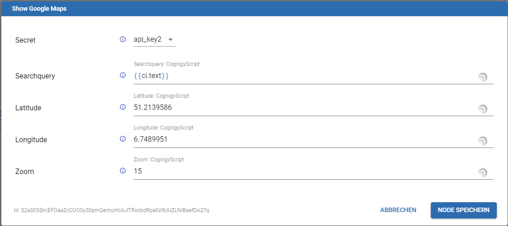

# Google Maps
Integrated Cognigy.AI with Google Maps (https://developers.google.com/maps/documentation/)

This module is based on node-request-promise (https://www.npmjs.com/package/request-promise)

### Secret
This modules needs a CognigySecret to be defined and passed to the Nodes. The secret must have the following keys:

- **key**:  api_key
- **value**: Your Google Maps API KEY

**Properties**

There are two ways to use this Custom Module. Use the [Google Maps Geocoding API](https://developers.google.com/maps/documentation/geocoding/start) to get the longitude and latitude of the address. 

If the Searchquery field is empty or no Place was found, the module use the default values from Latitude and Longitude. 
Here is an example of a filled google-maps node:

**View**
In combination with the google-maps Webchat Plugin you get this view:
